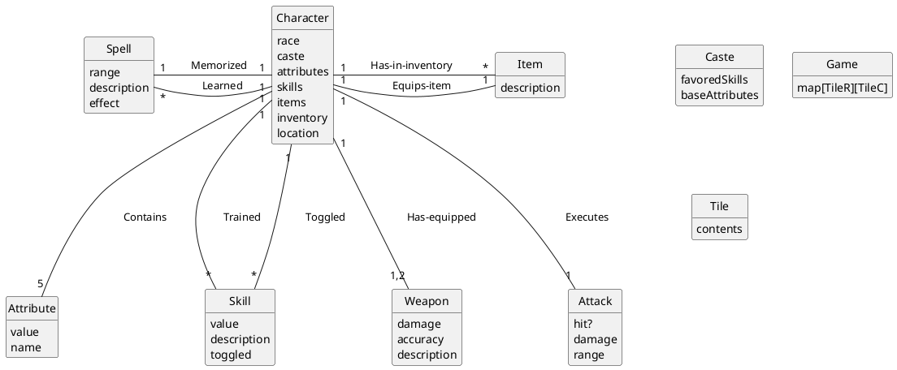
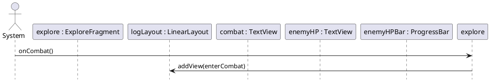
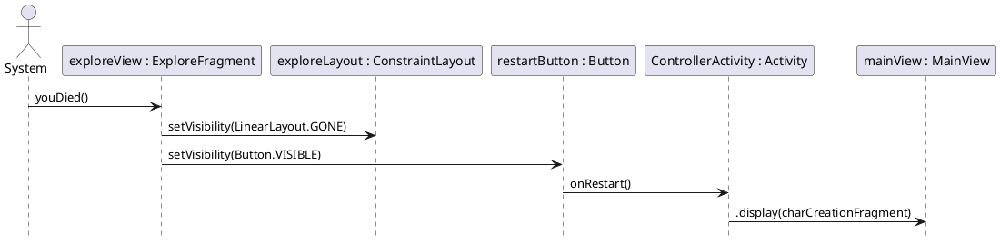
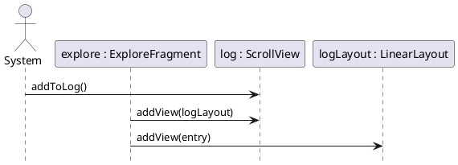
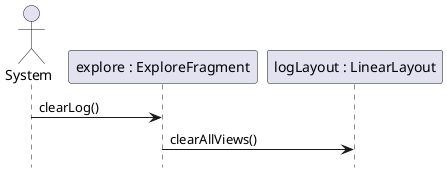

# Domain Model

```plantuml
@startuml

hide circle
hide empty methods

'classes
class Character {
    race
    caste
    attributes
    skills
    items
    inventory
    location
}

class Caste {
    favoredSkills
    baseAttributes
}

class Item {
    description
}

class Attribute {
    value
    name
}

class Skill {
    value
    description
    toggled
}

class Weapon {
    damage
    accuracy
    description
}

class Spell {
    range
    description
    effect
}

class Attack {
    hit?
    damage
    range
}

class Game {
    map[TileR][TileC]
}

class Tile {
    contents
}


'associations
Character "1" - "1" Item : \tEquips-item\t
Character "1" - "*" Item : \tHas-in-inventory\t\t

Character "1" --- "5" Attribute : \tContains\t\t

Character "1" -left- "1" Spell : \tMemorized\t
Character "1" -left- "*" Spell : \tLearned\t

Character "1" --- "*" Skill : \tTrained\t
Character "1" --- "*" Skill : \tToggled\t

Character "1" --- "1,2" Weapon : \tHas-equipped\t

Character "1" --- "1" Attack : \tExecutes\t


@enduml

```

# Sequence Diagrams

onCombat()

```plantuml
@startuml
hide footbox

actor System
participant "explore : ExploreFragment" as exploreFragment
participant "logLayout : LinearLayout" as logLayout
participant "combat : TextView" as enterCombat
participant "enemyHP : TextView" as enemyHP
participant "enemyHPBar : ProgressBar" as enemyHPBar

System -> explore: onCombat()
explore -> logLayout: addView(enterCombat)

@enduml
```

youDied()

```plantuml
@startuml
hide footbox

actor System

participant "exploreView : ExploreFragment" as exploreView
participant "exploreLayout : ConstraintLayout" as exploreLayout
participant "restartButton : Button" as restartButton
participant "ControllerActivity : Activity" as Controller
participant "mainView : MainView" as mainView

System -> exploreView: youDied()
exploreView -> exploreLayout: setVisibility(LinearLayout.GONE)
exploreView -> restartButton: setVisibility(Button.VISIBLE)

restartButton -> Controller: onRestart()
Controller -> mainView: .display(charCreationFragment)

@enduml
```

addToLog()

```plantuml
@startuml
hide footbox

actor System
participant "explore : ExploreFragment" as exploreFragment
participant "log : ScrollView" as log
participant "logLayout : LinearLayout" as logLayout

System -> log: addToLog()
exploreFragment -> log: addView(logLayout)
exploreFragment -> logLayout: addView(entry)


@enduml
```

clearLog()

```plantuml
@startuml
hide footbox

actor System
participant "explore : ExploreFragment" as exploreFragment
participant "logLayout : LinearLayout" as logLayout

System -> exploreFragment: clearLog()
exploreFragment -> logLayout: clearAllViews()

@enduml
enduml```

updateHp()
```plantuml
@startuml

hide footbox

actor System
participant "binding : FragmentExploreBinding" as binding
participant "pc : Character" as pc
participant "enemy : Character" as enemy
participant "gameState : int" as gameState
System -> binding :
ui -> pc : c1 = pc
ui -> enemy : c2 = enemy
alt winner
pc -> gameState : gameState = 3
else
enemy -> GameState : gameState = 10
end
@enduml
```

# Class Diagram

```plantuml
@startuml

hide footbox

'classes
abstract class Character {
    level : int
    race : Race
    caste : Caste
    myChar : char
    location : Tile
    dodgeValue : int
    armorValue : int 
    mental : int
    attributes : Attribute[]
    skills : ArrayList<Skill>
    items : Item[]
    inventory : Tile[]
    attunedSpell : Spell
    --
    public Tile[][] move(map : Tile[][])
    public void occupy(tile : Tile)
    public void executeMove(tile : Tile)
}

class  NPC {
    target : Character
    hostile : boolean
    --
    public void setTarget(target : Character)
    public Tile[][] move(map : Tile[][])
    public void occupy(tile : Tile)
}
class  Enemy {  
}


class Player {
    --
    
    public String move(game : Game, inputf : String)
}

Character <|-- NPC
Character <|-- Player
NPC <|-- Enemy


enum Race {
    favoredSkills : ArrayList<Skill>
    attributeAdjustments : int[]
    name : String
    description : String
}

enum Caste {
    favoredSkills : ArrayList<Skill>
    startingEquipment : ArrayList<Item>
    description : String
    name : String
}

abstract Item {
    description : String
    name : String
    --
    abstract Item drop()
}

class Attribute {
    value : int
    name : String
    description : String
    --
}

class Skill {
    value : float
    name : String
    description : String
    toggled : boolean
    aptitude : int
    --
    public void increment()
    public void toggle()
}
class Weapon {
damage : int 
accuracy : int 
twoHanded : boolean

}
class Potion {
attributeMulti : int 
usageTime : int 
}

class Tile {
    available : boolean
    occupant : Character
    display : character 
    x : int 
    y : int 
    public char display()

}


Item <|-- Weapon
Item <|-- Potion

class Game {
int gameState
map : Tile[][]
enemy : Character 
{static} pc : Player
{static} skills : ArrayList<Skill> 
{static} weapons : Weapon[]
{static} potions : Potion[]
{static} castes : Caste[]
{static} gladSkills : ArrayList<Skill>
{static} gladItems : ArrayList<Item>
{static} urSkills : ArrayList<Skill>
{static} urItems : ArrayList<Item>
{static} woodSkills : ArrayList<Skill>
{static} woodItems : ArrayList<Item>
{static} fishSkills : ArrayList<Skill>
{static} fishItems : ArrayList<Item>
{static} appSkills : ArrayList<Skill>
{static} appItems : ArrayList<Item>
{static} clerSkills : ArrayList<Skill>
{static} clerItems : ArrayList<Item>
{static} races : Race[]
{static} humSkills : ArrayList<Skill>
{static} humAtt : int[]
{static} minSkills : ArrayList<Skill>
{static} minAtt : int[]
{static} dwSkills : ArrayList<Skill>
{static} dwAtt : int[]
{static} sprSkills : ArrayList<Skill>
{static} sprAtt : int[]
{static} nySkills : ArrayList<Skill>
{static} nyAtt : int[]
{static} orcSkills : ArrayList<Skill>
{static} orcAtt : int[]
{static} kSkills : ArrayList<Skill>
{static} kAtt : int[]
--
public boolean checkAdjacent(player : Character)
public void createMap(size : int)
public void createSkills()
public void createWeapons
private void createPotions()
public void createCastes()

}

package View {

    interface ICharCreationView {
    void onConfirm(race : String, caste : String, att : int[])
    }

    class CharCreationFragment {
    binding : FragmentCharCreation
    listener : Listener
    --
    public View onCreateView(inflater : LayoutInflater , container : ViewGroup,  savedInstanceState : Bundle)
    public void onAttIncrease()
    public void onViewCreated(view : View, savedInstanceState : Bundle)
    public View getRootView()
    }

    interface IExploreFragment {
    void onInventory()
    void onCharSheet()
    void onEquipment()
    void onRestart()
    View getRootView()
    }

    class ExploreFragment {
        binding : FragmentExploreBinding
        listener : Listener
        game : Game
        combatLayout : LinearLayout
        depth : int
        --
        public void onCreateView(inflater : LayoutInflater, container : ViewGroup, savedInstanceState : Bundle)
        public void onViewCreated(view : View, savedInstanceState : Bundle)
        public String printMap(game : Game)
        public void onCombat()

        private void regen()
        private void setMove()
        private void setXpProgress()
        private void createLog()
        private void addToLog(text : TextView)
        private void clearLog()
        private void updateHP()
        private void youDied()
        private void replaceEnemy()
        private void spawnEnemy()

        public View getRootView()
    }
    interface IMainView {
    View getRootView()
    void displayFragment(Fragment fragment, boolean allowBack, String name);
    }
    class MainView {
        fmanager : FragmentManager
        binding : MainBinding
        --
        public void displayFragment(fragment : Fragment, allowBack : Boolean, name : String)
    }
}

class ControllerActivity {
    mainView : IMainView
    gameState : Game.GameState
    --
    protected void onCreate(savedInstanceState : Bundle)
    public void onConfirm(race : String, caste : String, att : int[])
    public void onRestart()
}

'associations
Game "1" - "1" Player : \tHas()\t
Game "1" - "1" NPC : \tHas()\t
Game "1" - "11" Skill : \tContainsListof()\t
Game "1" - "5" Caste : \tContainsListof()\t
Game "1" - "6" Race : \tContainsListof()\t
Game "1" - "8" Weapon : \tContainsListof()\t
Game "1" - "4" Potion : \tContainsListof()\t
TextUI "1" - "1" Game : \tHas()\t
Game "1" - "100" Tile : \tcontainsMapOf()\t


@enduml
```