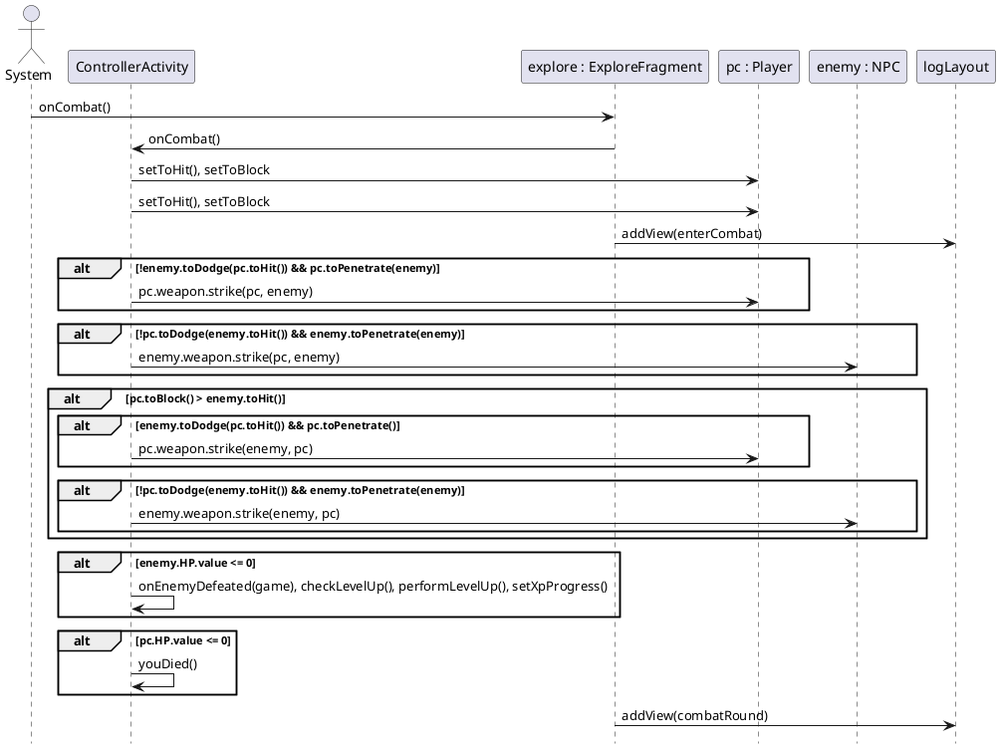
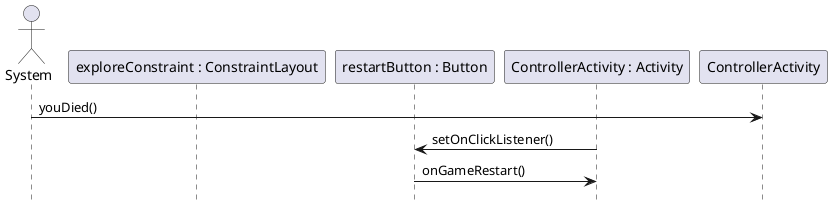
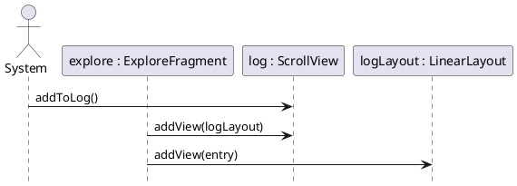
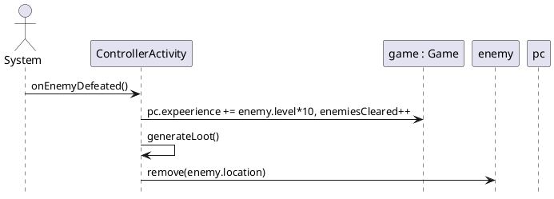
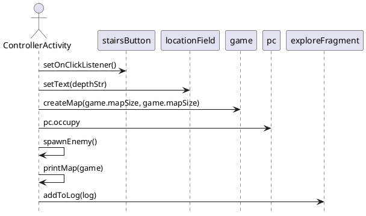

# Sequence Diagrams

# onCombat()

```plantuml
@startuml
hide footbox

actor System
participant ControllerActivity
participant "explore : ExploreFragment" as exploreFragment
participant "pc : Player" as pc
participant "enemy : NPC" as enemy

System -> exploreFragment: onCombat()
exploreFragment -> ControllerActivity: onCombat()
ControllerActivity -> pc: setToHit(), setToBlock
ControllerActivity -> pc: setToHit(), setToBlock
exploreFragment -> logLayout: addView(enterCombat)

alt !enemy.toDodge(pc.toHit()) && pc.toPenetrate(enemy)
ControllerActivity -> pc: pc.weapon.strike(pc, enemy)
end

alt !pc.toDodge(enemy.toHit()) && enemy.toPenetrate(enemy)
ControllerActivity -> enemy: enemy.weapon.strike(pc, enemy)
end

alt pc.toBlock() > enemy.toHit()
    alt enemy.toDodge(pc.toHit()) && pc.toPenetrate()
    ControllerActivity -> pc: pc.weapon.strike(enemy, pc)
    end
    alt !pc.toDodge(enemy.toHit()) && enemy.toPenetrate(enemy)
    ControllerActivity -> enemy: enemy.weapon.strike(enemy, pc)
    end
end


alt enemy.HP.value <= 0
ControllerActivity -> ControllerActivity: onEnemyDefeated(game), checkLevelUp(), performLevelUp(), setXpProgress()
end

alt pc.HP.value <= 0
ControllerActivity -> ControllerActivity: youDied()
end

exploreFragment -> logLayout: addView(combatRound)

@enduml
```

# youDied()

```plantuml
@startuml
hide footbox

actor System
participant "exploreConstraint : ConstraintLayout" as exploreLayout
participant "restartButton : Button" as restartButton
participant "ControllerActivity : Activity" as Controller

System -> ControllerActivity: youDied()

Controller -> restartButton: setOnClickListener()
restartButton -> Controller: onGameRestart()

@enduml
```

# addToLog()

```plantuml
@startuml
hide footbox

actor System
participant "explore : ExploreFragment" as exploreFragment
participant "log : ScrollView" as log
participant "logLayout : LinearLayout" as logLayout

System -> log: addToLog()
exploreFragment -> log: addView(logLayout)
exploreFragment -> logLayout: addView(entry)


@enduml
```

# onEnemyDefeated()

```plantuml
@startuml
hide footbox

actor System
participant ControllerActivity
participant "game : Game" as Game
participant enemy
participant pc

System -> ControllerActivity: onEnemyDefeated()
ControllerActivity -> Game: pc.expeerience += enemy.level*10, enemiesCleared++
ControllerActivity -> ControllerActivity: generateLoot()
ControllerActivity -> enemy: remove(enemy.location)

@enduml
enduml```

# onLeaderboard()
```plantuml
@startuml
hide footbox

actor System
participant ControllerActivity
participant leaderboardFragment
participant mainView

System -> ControllerActivity: onLeaderboard()
ControllerActivity -> leaderboardFragment: LeaderBoardFragment(this, game)
ControllerActivity -> mainView: displayFragment(leaderboardFragment, true, "leaderboard")

@enduml
enduml```

# onMove()
```plantuml
@startuml
hide footbox

actor exploreFragment
participant ControllerActivity
participant pc
participant enemy

exploreFragment -> ControllerActivity: onMove()
ControllerActivity -> pc: pc.move(game.map)
ControllerActivity -> enemy: enemy.move(game.map)
ControllerActivity -> ControllerActivity: printMap(game)
ControllerActivity -> ControllerActivity: onStairs()

@enduml
```

```plantuml
@startuml
hide footbox

actor ControllerActivity
participant stairsButton
participant locationField
participant game
participant pc
participant exploreFragment

ControllerActivity -> stairsButton: setOnClickListener()
ControllerActivity -> locationField: setText(depthStr)
ControllerActivity -> game: createMap(game.mapSize, game.mapSize)
ControllerActivity -> pc: pc.occupy
ControllerActivity -> ControllerActivity: spawnEnemy()
ControllerActivity -> ControllerActivity: printMap(game)
ControllerActivity -> exploreFragment: addToLog(log)
@enduml
```

```plantuml
@startuml
hide footbox

actor ControllerActivity
participant stairsButton
participant locationField
participant game
participant pc
participant exploreFragment

ControllerActivity -> stairsButton: setOnClickListener()
ControllerActivity -> locationField: setText(depthStr)
ControllerActivity -> game: createMap(game.mapSize, game.mapSize)
ControllerActivity -> pc: pc.occupy
ControllerActivity -> ControllerActivity: spawnEnemy()
ControllerActivity -> ControllerActivity: printMap(game)
ControllerActivity -> exploreFragment: addToLog(log)
@enduml
```

# Class Diagram

```plantuml
@startuml

hide footbox
abstract class Character {
    level : int
    race : Race
    caste : Caste
    myChar : char
    location : Tile
    
    sprite : int
    maxHP : int
    x : int
    y : int
    
    attributes : Attribute[]
    skills : ArrayList<Skill>
    items : Item[]
    inventory : Tile[]
    attunedSpell : Spell

    --
    public void calcStats()
    public void xpIncrement()
    public String levelUp()
    public void occupy(tile : Tile)
    public void executeMove(tile : Tile)
    public void remove(tile : Tile)
    public void equipWeapon(item : Item)
    public String drinkPotion() 
  
}

class  NPC {
    target : Character
    hostile : boolean
    --
    public void setTarget(target : Character)
    public Tile[][] move(map : Tile[][])
    public void occupy(tile : Tile)
}

class Player {
    int xpBase
    int scale
    int xpToLevel
    --
    public void setXpToLevel()
    public String move(game : Game, input : String)
}

Character <|-- NPC
Character <|-- Player

enum Race {
    favoredSkills : ArrayList<Skill>
    attributeAdjustments : int[]
    name : String
    description : String
}

enum Caste {
    favoredSkills : ArrayList<Skill>
    startingEquipment : ArrayList<Item>
    description : String
    name : String
}

abstract Item {
    description : String
    name : String
    disp : char
    equipable : boolean
    --
    abstract Item drop()
    public String getName()
}

class Attribute {
    value : int
    name : String
    description : String
    --
}

class Skill {
    value : float
    name : String
    description : String
    toggled : boolean
    aptitude : int
    --
    public void increment()
    public void toggle()
}

class Weapon {
    damage : double
    accuracy : double
    crit : double
    twoHanded : boolean
    enum Weapons
    --
    public double strike(user : Character, target : Character)
}

enum Weapons {
    DAGGER
    SWORD
    BRASSKNUCKLES
    HARPOON
    SABRE
    CLUB
    BALLANDCHAIN
    HAMMER
    MACE
} 
Weapons -> Weapon

class Potion {
    name : String
    factor : int
    target : int
    enum Potions
    --
    public String drink(target : Character)
    public String getName()
    
}
enum Potions {
    HEALTH
    DEX
    STR
    INT
    WILL
}

Potions -> Potion

class Armor {
    encumberance : double
    AV : double
    enum Armors
    --
    public String getName()
}

enum Armors {
    CHAIN
    LEATHER
    PLATE
    ROBES
    RAGS
    CLOTHES    
}

Armors -> Armor

class Tile {
    available : boolean
    occupant : Character
    display : character 
    x : int 
    y : int 
    floor : R.drawable
    ladder : R.drawable
    --
    public char display()
    public void toStairs()
}

Item <|-- Weapon
Item <|-- Potion
Item <|-- Armor

class Game {
depth : int
gameState : GameStates
enemiesCleared : int
map : Tile[][]
enemy : NPC 
pc : Player
--
public boolean checkAdjacent()
public void createMap(sizeX : int, sizeY : int)
public static void createSkills()
}


package View {
}

class ControllerActivity {
    IMainView mainView
    Game game
    private static final String CUR_GAME
    FragmentExploreBinding binding
    ExploreFragment exploreFragment
    FragmentInventoryBinding inventoryBinding
    InventoryFragment inventoryFragment
    CharacterSheetFragmant charSheetFragment
    IPersistenceFacade persistenceFacade
    LeaderBoardFragment leaderBoardFragment
    --
    public void onConfirmCharacter(String race, String cast, int[] att)
    public void onInventory()
    public String onCombat(Game game, String input)
    public void printMap(Game game)
    public int printTile(Tile tile)
    private boolean checkLevelUp()
    private void setXpProgress()
    private void youDied()
    public void saveGame(String name)
    public String onEnemyDefeated(Game game)
    private String generateLoot()
    private String spellLearned()
    public void updateHP()
    private String replaceEnemy()
    private String spawnEnemy()
    private String levelCleared()
    public void performLevelUp()
    public void onLeaderboard()
    public String onMove()
    public void onStairs()
    public void onCharSheet()
    public void onSpell()
    public void onGameRestart()
    public void onClose()
    public void onEquip()    
}

'associations
Game "1" -> "1" Player : \tHas()\t
Game "1" -> "1" NPC : \tHas()\t
Game "1" -> "11" Skill : \tcontainsListof()\t
Caste "1" -> "1" Game : \tgetsCastePresets()\t
Race "1" -> "1" Game : \tgetsRacePresets()\t
Game "1" -> "100" Tile : \tcontainsMapOf()\t
View "*" -> "1" ControllerActivity : \tcontains()\t

@enduml
```

```plantuml
@startuml
hide footbox

package View {

interface IMainView {
}

class MainView {
    FragmentManager fmanager
    MainBinding binding
    --
    public void displayFragment(Fragment fragment, boolean allowBack, String name)
}

MainView "1" --|> "1" IMainView : \timplements\t

interface ICharCreationView {
}

class CharCreationFragment {
    FragmentCharCreationBinding binding
    Listener listener
    Game testGame
    --
    public void onAttIncrease()
    private void updateDescriptions()
    public void onViewCreated(View view, Bundle savedInstanceState)
}

CharCreationFragment "1" --|> "1" ICharCreationView : \timplements\t

interface IExploreFragment {
}

class ExploreFragment {
    FragmentExploreBinding fmanager
    Listener listener
    Game game
    private final String CURGAME
    LinearLayout combatLayout
    --
    public View onViewCreated(View view, Bundle savedInstanceState)
    public void populate()
    private void setMap()
    private void menuButtons()
    public String regen()
    public void setMove(String input)
    private void createLog()
    public void addToLog(TextView view)
    private void setCombatButtons()
    private void clearLog()
    public void onCombat()
}
ExploreFragment "1" --|> "1" IExploreFragment : \timplements\t

interface IInventoryFragment {
}
class InventoryFragment {
    int armorGreen
    int potionTeal
    int weaponRed
    int spellPurple
    FragmentInventoryBinding binding
    Listener listener
    Game game
    private ifnal String CURGAME
    --
    public void onViewCreated(View view, Bundle savedInstanceState)
    private void setEquipmentButtons()
    private void displayInventory(List<Item> inventory)
    private void updateInventory()
}
InventoryFragment "1" --|> "1" IInventoryFragment : \timplements\t

interface ICharacterSheetFragment {
}
class CharacterSheetFragment {
    FragmentCharacterSheetBinding binding
    Listener listener
    Game game
    private final String CURGAME
    --
    public void onViewCreated(View view, Bundle savedInstanceState)
    private void charInfo()
    private void attributeButtons()
    private void skillLayout()
}
CharacterSheetFragment "1" --|> "1" ICharacterSheetFragment : \timplements\t

interface IPersistenceFacade {
}
class FirestoreFacade {
    FirebaseFirestore db
    private static final String GAME_COLLECTION
    --
    public void saveGame(Game game, String name)
    public ArrayList<LeaderboardEntry> retrieveScores()
}
FirestoreFacade "1" --|> "1" IPersistenceFacade : \timplements\t

class LeaderboardEntry {
    String name
    int depth
}
FirestoreFacade "1" --|> "1" LeaderboardEntry : \tcontains\t

interface ILeaderBoardFragment {}
class LeaderBoardFragment {
    public ArrayList<FirestoreFacade.LeaderboardEntry> leaderboardMap
    Game game
    Listener listener
    FragmentLeaderboardBinding binding
    private final String CURGAME
}
}


@enduml
```