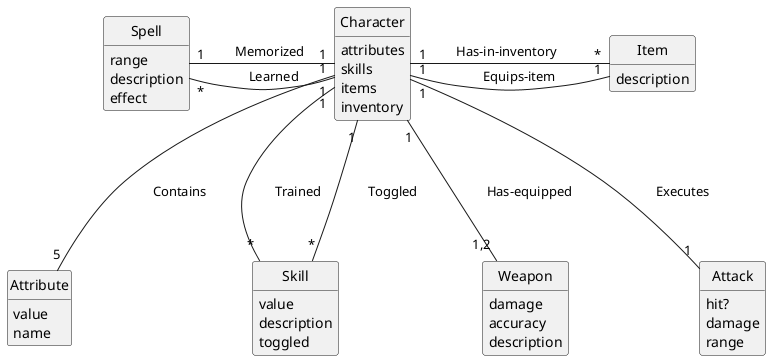

```plantuml

@startuml

hide circle
hide empty methods

'classes
class Character {
    attributes
    skills
    items
    inventory
}

class Item {
    description
}

class Attribute {
    value
    name
}

class Skill {
    value
    description
    toggled
}

class Weapon {
    damage
    accuracy
    description
}

class Spell {
    range
    description
    effect
}

class Attack {
    hit?
    damage
    range
}


'associations
Character "1" - "1" Item : \tEquips-item\t
Character "1" - "*" Item : \tHas-in-inventory\t\t

Character "1" --- "5" Attribute : \tContains\t\t

Character "1" -left- "1" Spell : \tMemorized\t
Character "1" -left- "*" Spell : \tLearned\t

Character "1" --- "*" Skill : \tTrained\t
Character "1" --- "*" Skill : \tToggled\t

Character "1" --- "1,2" Weapon : \tHas-equipped\t

Character "1" --- "1" Attack : \tExecutes\t


@enduml

@startuml
@enduml

```