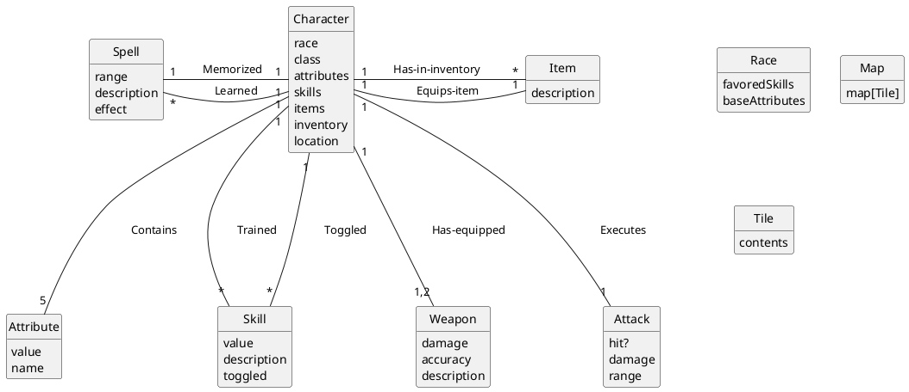
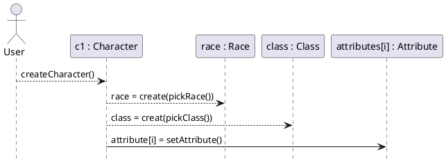
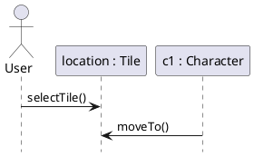
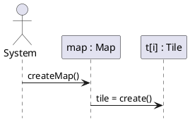
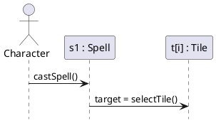
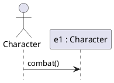
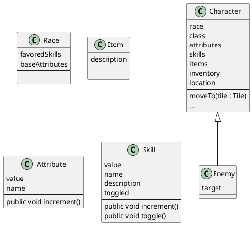

# Domain Model

```plantuml

@startuml

hide circle
hide empty methods

'classes
class Character {
    race
    class
    attributes
    skills
    items
    inventory
    location
}

class Race {
    favoredSkills
    baseAttributes
}

class Item {
    description
}

class Attribute {
    value
    name
}

class Skill {
    value
    description
    toggled
}

class Weapon {
    damage
    accuracy
    description
}

class Spell {
    range
    description
    effect
}

class Attack {
    hit?
    damage
    range
}

class Map {
    map[Tile]
}

class Tile {
    contents
}


'associations
Character "1" - "1" Item : \tEquips-item\t
Character "1" - "*" Item : \tHas-in-inventory\t\t

Character "1" --- "5" Attribute : \tContains\t\t

Character "1" -left- "1" Spell : \tMemorized\t
Character "1" -left- "*" Spell : \tLearned\t

Character "1" --- "*" Skill : \tTrained\t
Character "1" --- "*" Skill : \tToggled\t

Character "1" --- "1,2" Weapon : \tHas-equipped\t

Character "1" --- "1" Attack : \tExecutes\t


@enduml
```
# Sequence Diagrams
start-game

```plantuml

@startuml
hide footbox

actor User
participant "c1 : Character" as character
participant "race : Race" as race
participant "class : Class" as class
participant "attributes[i] : Attribute" as attribute

User --> character : createCharacter()
character --> race : race = create(pickRace())
character --> class : class = creat(pickClass())
character -> attribute : attribute[i] = setAttribute()

@enduml
```

move

```plantuml
@startuml

hide footbox

actor User
participant "location : Tile" as loc
participant "c1 : Character" as char

User -> loc : selectTile()
char -> loc : moveTo()


@enduml
```

build-map

```plantuml
@startuml

hide footbox

actor System
participant "map : Map" as map
participant "t[i] : Tile" as tile

System -> map : createMap()
map -> tile : tile = create()

@enduml
```

cast-spell

```plantuml
@startuml

hide footbox

actor Character
participant "s1 : Spell" as spell
participant "t[i] : Tile" as target

Character -> spell : castSpell()
spell -> target : target = selectTile()

@enduml
```

attack

```plantuml
@startuml

hide footbox

actor Character
participant "e1 : Character" as enemy

Character -> enemy : combat()
@enduml
```

# Class Diagram

```plantuml
@startuml

hide footbox

'classes
class Character {
    race
    class
    attributes
    skills
    items
    inventory
    location
    --
    moveTo(tile : Tile)
    ...
}

class Enemy {
    target
}
Character <|-- Enemy


class Race {
    favoredSkills
    baseAttributes
    --
    
}

class Item {
    description
    --
    
}

class Attribute {
    value
    name
    --
    public void increment()
}

class Skill {
    value
    name
    description
    toggled
    --
    public void increment()
    public void toggle()
}
@enduml
```