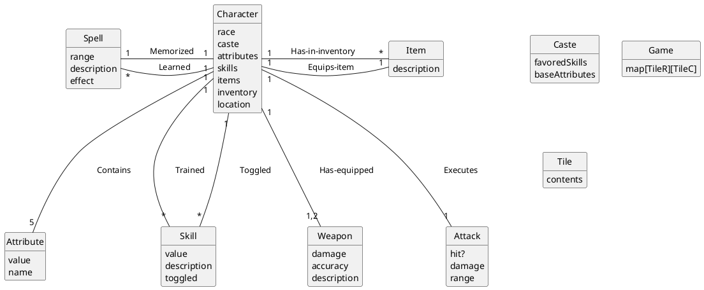
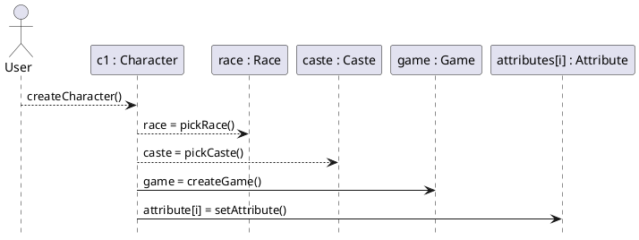
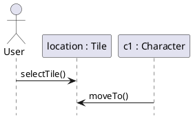
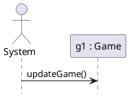
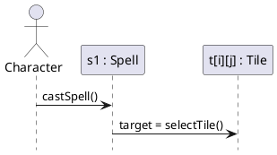
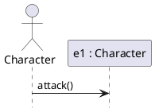
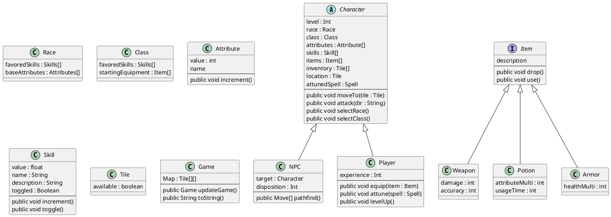

# Domain Model

```plantuml
@startuml

hide circle
hide empty methods

'classes
class Character {
    race
    caste
    attributes
    skills
    items
    inventory
    location
}

class Caste {
    favoredSkills
    baseAttributes
}

class Item {
    description
}

class Attribute {
    value
    name
}

class Skill {
    value
    description
    toggled
}

class Weapon {
    damage
    accuracy
    description
}

class Spell {
    range
    description
    effect
}

class Attack {
    hit?
    damage
    range
}

class Game {
    map[TileR][TileC]
}

class Tile {
    contents
}


'associations
Character "1" - "1" Item : \tEquips-item\t
Character "1" - "*" Item : \tHas-in-inventory\t\t

Character "1" --- "5" Attribute : \tContains\t\t

Character "1" -left- "1" Spell : \tMemorized\t
Character "1" -left- "*" Spell : \tLearned\t

Character "1" --- "*" Skill : \tTrained\t
Character "1" --- "*" Skill : \tToggled\t

Character "1" --- "1,2" Weapon : \tHas-equipped\t

Character "1" --- "1" Attack : \tExecutes\t


@enduml

```
# Sequence Diagrams
start-game

```plantuml

@startuml
hide footbox

actor User
participant "c1 : Character" as character
participant "race : Race" as race
participant "caste : Caste" as caste
participant "game : Game" as game
participant "attributes[i] : Attribute" as attribute

User --> character : createCharacter()
character --> race : race = pickRace()
character --> caste : caste = pickCaste()
character -> game : game = createGame()
character -> attribute : attribute[i] = setAttribute()
@enduml
```

move

```plantuml
@startuml

hide footbox

actor User
participant "location : Tile" as loc
participant "c1 : Character" as char

User -> loc : selectTile()
char -> loc : moveTo()


@enduml
```

updateGame

```plantuml
@startuml

hide footbox

actor System
participant "g1 : Game" as Game
System -> Game : updateGame()
@enduml
```

cast-spell

```plantuml
@startuml

hide footbox

actor Character
participant "s1 : Spell" as spell
participant "t[i][j] : Tile" as target

Character -> spell : castSpell()
spell -> target : target = selectTile()

@enduml
```

attack

```plantuml
@startuml

hide footbox

actor Character
participant "e1 : Character" as enemy

Character -> enemy : attack()
@enduml
```

# Class Diagram

```plantuml
@startuml

hide footbox

'classes
abstract class Character {
    level : Int
    race : Race
    class : Class
    attributes : Attribute[]
    skills : Skill[]
    items : Item[]
    inventory : Tile[]
    location : Tile
    attunedSpell : Spell
    --
    public void moveTo(tile : Tile)
    public void attack(dir : String)
    public void selectRace()
    public void selectClass()
}

class  NPC {
    target : Character
    disposition : Int
    --
    public Move[] pathfind()
}

class Player {
    experience : Int
    --
    public void equip(item : Item)
    public void attune(spell : Spell)
    public void levelUp()
}

Character <|-- NPC
Character <|-- Player


class Race {
    favoredSkills : Skills[]
    baseAttributes : Attributes[]
}

class Class {
    favoredSkills : Skills[]
    startingEquipment : Item[]
}

interface Item {
    description
    --
    public void drop()
    public void use()
}

class Attribute {
    value : int
    name
    --
    public void increment()
}

class Skill {
    value : float
    name : String
    description : String
    toggled : Boolean
    --
    public void increment()
    public void toggle()
}
class Weapon {
damage : int 
accuracy : int 
}
class Potion {
attributeMulti : int 
usageTime : int 
}
class Armor {
healthMulti : int 
}
Item <|-- Weapon
Item <|-- Potion
Item <|-- Armor

class Tile {
available : boolean
}

class Game {
Map : Tile[][]
--
public Game updateGame()
public String toString()
}


@enduml
```