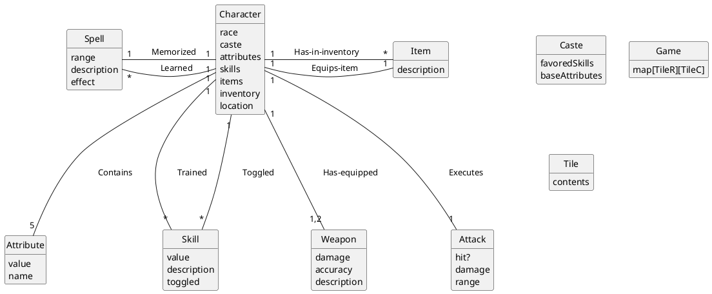
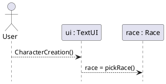
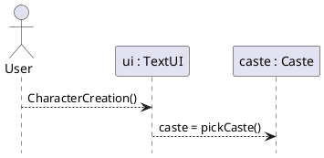
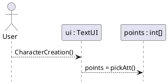
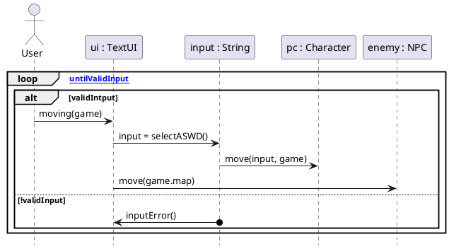
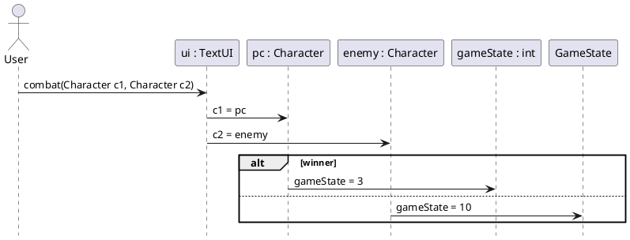
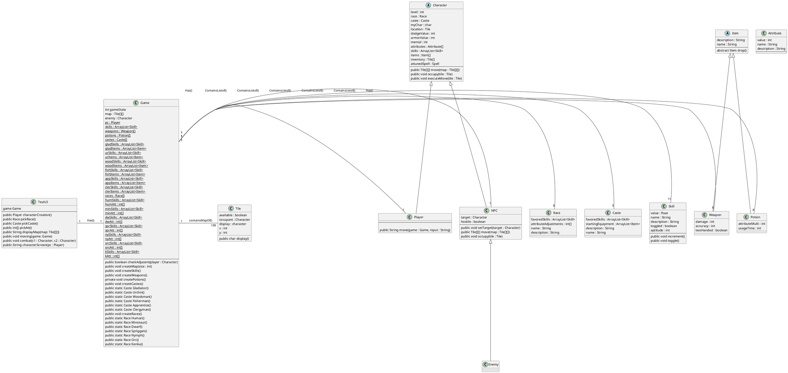

# Domain Model

```plantuml
@startuml

hide circle
hide empty methods

'classes
class Character {
    race
    caste
    attributes
    skills
    items
    inventory
    location
}

class Caste {
    favoredSkills
    baseAttributes
}

class Item {
    description
}

class Attribute {
    value
    name
}

class Skill {
    value
    description
    toggled
}

class Weapon {
    damage
    accuracy
    description
}

class Spell {
    range
    description
    effect
}

class Attack {
    hit?
    damage
    range
}

class Game {
    map[TileR][TileC]
}

class Tile {
    contents
}


'associations
Character "1" - "1" Item : \tEquips-item\t
Character "1" - "*" Item : \tHas-in-inventory\t\t

Character "1" --- "5" Attribute : \tContains\t\t

Character "1" -left- "1" Spell : \tMemorized\t
Character "1" -left- "*" Spell : \tLearned\t

Character "1" --- "*" Skill : \tTrained\t
Character "1" --- "*" Skill : \tToggled\t

Character "1" --- "1,2" Weapon : \tHas-equipped\t

Character "1" --- "1" Attack : \tExecutes\t


@enduml

```
# Sequence Diagrams
pickRace()

```plantuml

@startuml
hide footbox

actor User
participant "ui : TextUI" as ui
participant "race : Race" as race

User --> ui : CharacterCreation()
ui --> race : race = pickRace()
@enduml
```
pickCaste()

```plantuml

@startuml
hide footbox

actor User
participant "ui : TextUI" as ui
participant "caste : Caste" as caste

User --> ui : CharacterCreation()
ui --> caste : caste = pickCaste()
@enduml
```
pickAtt()

```plantuml

@startuml
hide footbox

actor User
participant "ui : TextUI" as ui
participant "points : int[]" as points

User --> ui : CharacterCreation()
ui --> points : points = pickAtt()
@enduml
```

moving()

```plantuml
@startuml

hide footbox

actor User
participant "ui : TextUI" as ui
participant "input : String" as input
participant "pc : Character" as pc
participant "enemy : NPC" as enemy

loop [untilValidInput]
alt validIntput
User -> ui : moving(game)
ui -> input : input = selectASWD()
input -> pc : move(input, game)
ui -> enemy : move(game.map)
else !validInput
input o-> ui : inputError()
end
end
@enduml
```
void combat(Character c1, Character c2)

```plantuml
@startuml

hide footbox

actor User
participant "ui : TextUI" as ui
participant "pc : Character" as pc
participant "enemy : Character" as enemy
participant "gameState : int" as gameState
User -> ui : combat(Character c1, Character c2)
ui -> pc : c1 = pc
ui -> enemy : c2 = enemy
alt winner
pc -> gameState : gameState = 3
else 
enemy -> GameState : gameState = 10
end
@enduml
```

# Class Diagram

```plantuml
@startuml

hide footbox

'classes
abstract class Character {
    level : int
    race : Race
    caste : Caste
    myChar : char
    location : Tile
    dodgeValue : int
    armorValue : int 
    mental : int
    attributes : Attribute[]
    skills : ArrayList<Skill>
    items : Item[]
    inventory : Tile[]
    attunedSpell : Spell
    --
    public Tile[][] move(map : Tile[][])
    public void occupy(tile : Tile)
    public void executeMove(tile : Tile)
}

class  NPC {
    target : Character
    hostile : boolean
    --
    public void setTarget(target : Character)
    public Tile[][] move(map : Tile[][])
    public void occupy(tile : Tile)
}
class  Enemy {  
}


class Player {
    --
    
    public String move(game : Game, input : String)
}

Character <|-- NPC
Character <|-- Player
NPC <|-- Enemy


class Race {
    favoredSkills : ArrayList<Skill>
    attributeAdjustments : int[]
    name : String
    description : String
}

class Caste {
    favoredSkills : ArrayList<Skill>
    startingEquipment : ArrayList<Item>
    description : String
    name : String
}

abstract Item {
    description : String
    name : String
    --
    abstract Item drop()
}

class Attribute {
    value : int
    name : String
    description : String
    --
}

class Skill {
    value : float
    name : String
    description : String
    toggled : boolean
    aptitude : int
    --
    public void increment()
    public void toggle()
}
class Weapon {
damage : int 
accuracy : int 
twoHanded : boolean

}
class Potion {
attributeMulti : int 
usageTime : int 
}

class Tile {
    available : boolean
    occupant : Character
    display : character 
    x : int 
    y : int 
    public char display()

}
class TextUI {
    game Game
    --
    public Player characterCreation()
    public Race pickRace()
    public Caste pickCaste()
    public int[] pickAtt()
    public String displayMap(map: Tile[][])
    public void moving(game: Game)
    public void combat(c1 : Character, c2 : Character)
    public String characterScreen(pc : Player)
    }

Item <|-- Weapon
Item <|-- Potion

class Game {
int gameState
map : Tile[][]
enemy : Character 
{static} pc : Player
{static} skills : ArrayList<Skill> 
{static} weapons : Weapon[]
{static} potions : Potion[]
{static} castes : Caste[]
{static} gladSkills : ArrayList<Skill>
{static} gladItems : ArrayList<Item>
{static} urSkills : ArrayList<Skill>
{static} urItems : ArrayList<Item>
{static} woodSkills : ArrayList<Skill>
{static} woodItems : ArrayList<Item>
{static} fishSkills : ArrayList<Skill>
{static} fishItems : ArrayList<Item>
{static} appSkills : ArrayList<Skill>
{static} appItems : ArrayList<Item>
{static} clerSkills : ArrayList<Skill>
{static} clerItems : ArrayList<Item>
{static} races : Race[]
{static} humSkills : ArrayList<Skill>
{static} humAtt : int[]
{static} minSkills : ArrayList<Skill>
{static} minAtt : int[]
{static} dwSkills : ArrayList<Skill>
{static} dwAtt : int[]
{static} sprSkills : ArrayList<Skill>
{static} sprAtt : int[]
{static} nySkills : ArrayList<Skill>
{static} nyAtt : int[]
{static} orcSkills : ArrayList<Skill>
{static} orcAtt : int[]
{static} kSkills : ArrayList<Skill>
{static} kAtt : int[]
--
public boolean checkAdjacent(player : Character)
public void createMap(size : int)
public void createSkills()
public void createWeapons()
private void createPotions()
public void createCastes()
public static Caste Gladiator()
public static Caste Urchin()
public static Caste Woodsman()
public static Caste Fisherman()
public static Caste Apprentice()
public static Caste Clergyman()
public void createRaces()
public static Race Human()
public static Race Minotaur()
public static Race Dwarf()
public static Race Spriggan()
public static Race Nymph()
public static Race Orc()
public static Race Kenku()
}
'associations
Game "1" - "1" Player : \tHas()\t
Game "1" - "1" NPC : \tHas()\t
Game "1" - "11" Skill : \tContainsListof()\t
Game "1" - "5" Caste : \tContainsListof()\t
Game "1" - "6" Race : \tContainsListof()\t
Game "1" - "8" Weapon : \tContainsListof()\t
Game "1" - "4" Potion : \tContainsListof()\t
TextUI "1" - "1" Game : \tHas()\t
Game "1" - "100" Tile : \tcontainsMapOf()\t


@enduml
```